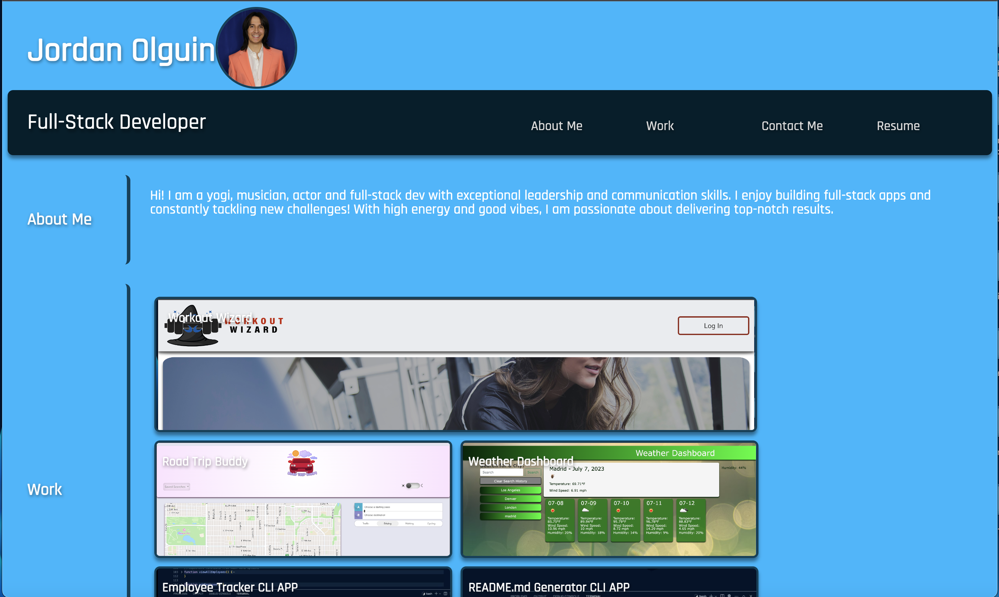

# WebDevPortfolio

As a recent Full Stack Web Dev Bootcamp graduate, I want a professional portfolio to display my work to potential employers and colleagues.

## Installation

Navigate to https://jordanolguin.github.io/WebDevPortfolio/

## Usage

Easy-to-use and interactive UI/UX presents my information with a minimalistic/modern style.

## Contributing

Pull requests are welcome. For major changes, please open an issue first
to discuss what you would like to change.

Please make sure to update tests as appropriate.

## License

[MIT](https://choosealicense.com/licenses/mit/)
